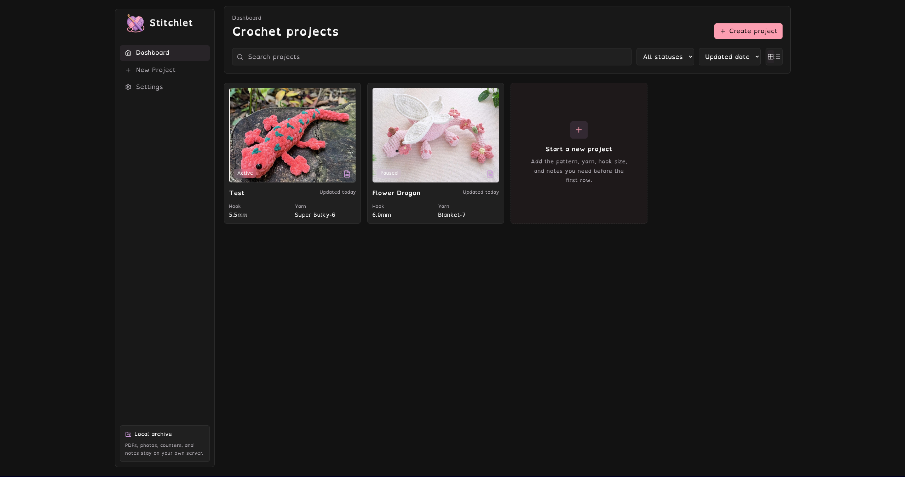
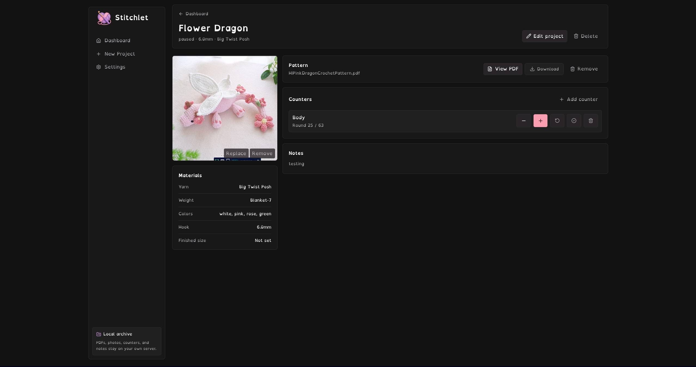

<p align="center">
  
</p>

# Stitchlet

Stitchlet is a private, self-hosted crochet project companion designed to run on your own hardware (mini-PC, NAS, home server, or local computer). It keeps all of your pattern PDFs, progress photos, stitch counters, and notes local, cozy, and completely under your control. No surprise cloud subscriptions, no telemetry, just your projects.

<p align="center">
  
  
</p>

## Core Features

* 📱 **Cozy, Responsive UI** – Sleek charcoal-themed dashboard with grid and list views, optimized for both desktop monitors and amigurumi-friendly mobile screens.
* 🔍 **Smart Dashboard** – Reactive searching, status filtering (Active, Paused, Finished, Frogged), and sorting (updated date, project title, status) to organize large libraries instantly.
* 📄 **In-App PDF Viewer** – Upload pattern PDFs, view them in an embedded full-screen modal directly inside your project page, or download them at any time.
* 📸 **Progress Photos** – Keep visual records of your work. Upload and replace cover photos with responsive, square CSS crops.
* ⏱️ **Active Counters** – Add multiple round or row counters per project with custom names, target values, completion states, and large tap targets designed to be used while actively crocheting.
* 🧶 **Material Checklists** – Quick metadata fields for yarn type, yarn weight, hook size, colors, and finished dimensions, plus custom list sections for assembly details and yarn substitutions.
* 💾 **One-Click Backup & Restore** – Download a compressed ZIP archive containing your SQLite database and all uploaded media files directly from the UI settings.
* 📶 **Progressive Web App (PWA)** – Installable as a standalone app with Network-First Service Worker asset caching, allowing the app shell to launch instantly and work offline.

---

## Deploying with Docker Compose (Recommended)

Docker is the easiest way to deploy Stitchlet on a home server or NAS (such as Unraid, Synology, or TrueNAS). 

Create a `docker-compose.yml` file:

```yaml
services:
  stitchlet:
    image: pinkpixeldev/stitchlet:latest
    container_name: stitchlet
    ports:
      - "6497:6497"
    volumes:
      - ./data:/app/data
      - ./uploads:/app/uploads
      - ./backups:/app/backups
    environment:
      - NODE_ENV=production
      - PORT=6497
    restart: unless-stopped
```

Run the container:

```bash
docker compose up -d
```

Open your browser and navigate to:

```txt
http://localhost:6497
```

### Mounted Volumes

Three folders are created in your compose directory to persist all library data outside the container:
* `data/` – Houses your SQLite database file (`stitchlet.db`).
* `uploads/` – Stores pattern PDFs and progress photos.
* `backups/` – Temporary staging directory for exported archives.

---

## Local Development & Setup

If you prefer to run Stitchlet natively on your machine:

### Prerequisites

* Node.js v22+
* npm

### Running the App

1. Install dependencies:
   ```bash
   npm install
   ```

2. Start the development environment (runs Vite and Hono concurrently):
   ```bash
   npm run dev
   ```

3. Open:
   ```txt
   http://localhost:6497
   ```

The Vite development server hosts the frontend on port `6497` and proxies backend API calls to Hono on port `6498`.

---

## PWA & Private Remote Access

For full PWA installability, browsers require that the app is accessed over `localhost` or served via HTTPS:

1. **Home Wi-Fi only**: Access Stitchlet on your local network using the host IP (e.g. `http://192.168.1.50:6497`).
2. **Private Remote Access (Tailscale)**: If you want to use your counters and view patterns while away from home, Tailscale is recommended. Run `tailscale serve` on your host to securely route HTTPS traffic within your private tailnet without opening router ports.
3. **Domain Routing**: Use a reverse proxy like Caddy to configure SSL certificates for your host domain.

---

## Backing Up Your Library

Because Stitchlet is private and local, you are in charge of your data. 

1. **Via UI Settings**: Navigate to **Settings > Backup & Restore** and click **Export Backup**. This will compile a zip file of your SQLite database and all uploaded project media.
2. **Restoring**: Choose the exported ZIP file inside settings. Stitchlet will automatically unpack the files, close existing SQLite connections, overwrite files, and trigger a server reboot sequence.
3. **Automated Host Backups**: Simply back up the mounted `./data` and `./uploads` directories using your home server's backup scheduler.

---

## License

Apache 2.0

Made with 💖 by [Pink Pixel](https://pinkpixel.dev)
